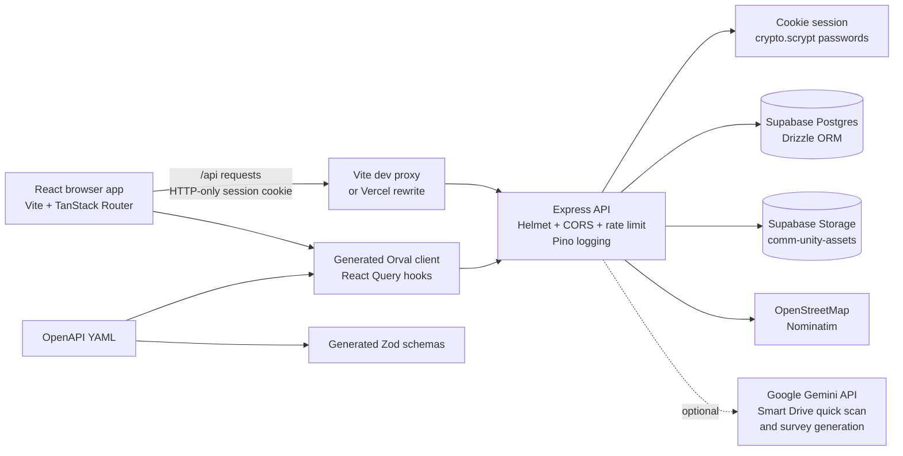

# CommUnity Hub

CommUnity Hub is a multi-organization coordination platform for NGOs, community coordinators, and volunteers. It turns community needs into trackable work, connects those needs with volunteers, and provides shared surveys, files, maps, and operational dashboards.

## Current Features

- Organization management with organization-scoped data access.
- Dashboard statistics, activity, zones, urgency indicators, and local operational insights.
- Need reporting and lifecycle tracking: reported, verified, assigned, in progress, resolved, and closed.
- Volunteer directory, profiles, skills, availability, task assignments, self-assignment, progress updates, notifications, and credential resets.
- Map and heatmap views for needs, with OpenStreetMap Nominatim geocoding.
- Survey creation, duplication, public response forms, response summaries, quality checks, and recent responses.
- Smart Drive file storage using Supabase Storage, including volunteer upload approvals and admin visibility controls.
- Need attachments stored in Supabase Storage.
- CSV/XLS/XLSX bulk need import with column mapping, validation, editing, and result reporting.
- Local operations assistant that answers supported dashboard questions from database data without calling an external AI model.
- Optional Gemini-powered Smart Drive quick scan and survey generation when `GEMINI_API_KEY` is configured.
- English, Hindi, and Gujarati interface translations.

The standalone **OCR Scanner** and **Impact Report** pages and APIs have been removed. Volunteer-level impact summaries remain part of the volunteer workflow.

## Architecture



### Repository layout

```text
.
├── api/                         Vercel serverless API entrypoint
├── artifacts/
│   ├── api-server/              Express API package
│   │   └── src/
│   │       ├── app.ts           Middleware and route mounting
│   │       ├── index.ts         Local HTTP server entrypoint
│   │       ├── lib/             Auth, AI, email, geocoding, storage, logging
│   │       └── routes/          Feature API routers
│   ├── community-hub/           Vite React application
│   │   └── src/
│   │       ├── pages/            User-facing screens
│   │       ├── routes/           TanStack file-based routes
│   │       ├── components/       Shared UI components
│   │       └── lib/              Context, API helpers, layout, PDF utilities
│   └── mockup-sandbox/           Separate UI mockup playground
├── lib/
│   ├── api-spec/                OpenAPI source and Orval configuration
│   ├── api-client-react/        Generated React Query API client
│   ├── api-zod/                 Generated Zod request/response schemas
│   └── db/                      Drizzle schema and database tooling
└── vercel.json                  Vercel build, rewrite, and function settings
```

## Frontend

The frontend package is `@workspace/community-hub`.

- **React 19** with Vite.
- **TanStack Router** with file-based routes. `routeTree.gen.ts` is generated by the router Vite plugin.
- **TanStack React Query** for server state and cache invalidation.
- **Tailwind CSS**, Radix UI primitives, and Lucide icons.
- **React Hook Form**, Zod resolvers, Recharts, Leaflet, XLSX, Papa Parse, jsPDF, and DOCX tooling for feature workflows.
- `AppProvider` owns authentication state, selected organization, language, and organization queries.
- `AppLayout` provides the admin sidebar and organization switcher.
- `AuthGuard` protects application routes, handles login, password changes, and the volunteer dashboard.

Current primary routes include `/`, `/login`, `/needs`, `/map`, `/volunteers`, `/surveys`, `/smart-drive`, `/upload-hub`, `/chat`, `/settings`, and `/volunteer-dashboard`. Public survey forms are served under `/forms/:id/view`.

## Backend

The backend package is `@workspace/api-server`. It exposes an Express application mounted under `/api`.

### Middleware

- Helmet security headers.
- CORS with credentials enabled.
- HTTP-only cookie parsing.
- JSON and URL-encoded request bodies, with a 50 MB limit.
- Rate limiting on `/api`: 100 requests per IP per 15 minutes.
- Pino HTTP request logging.
- Static `/uploads` handling for legacy/local upload paths.

### API groups

| Router | Responsibilities |
| --- | --- |
| `health` | `GET /api/healthz` health check |
| `auth` | Login, logout, current user, password changes, volunteer password resets |
| `organizations` | List, create, view, and update organizations |
| `needs` | Need CRUD, status, urgency, bulk import, assignments, audit, geocoding, and progress |
| `volunteers` | Volunteer CRUD, availability, tasks, notifications, assignments, profile, and volunteer impact |
| `surveys` | Survey CRUD, generation, public forms, responses, summaries, duplication, and quality checks |
| `dashboard` | Statistics, activity, zones, and operational insights |
| `chat` | Local operations assistant |
| `smart-drive` | File list, upload, approval metadata, deletion, and optional quick scan |
| `attachments` | Need attachment list, upload, and deletion |

## Data Layer

`@workspace/db` uses Drizzle ORM with PostgreSQL. The current schema modules are:

- `organizations`: tenant records and activation state.
- `auth`: users, roles, password hashes, and account state.
- `needs`: community need records, categories, status, severity, and location.
- `volunteers`: volunteer identity, skills, availability, and activity.
- `assignments`: need/volunteer assignment lifecycle and progress.
- `audit_trail`: need history and administrative actions.
- `surveys`: survey definitions and responses.
- `smart_drive`: organization file metadata and approval state.
- `need_attachments`: files attached to individual needs.

The backend uses a direct PostgreSQL connection through `DATABASE_URL`. Supabase is the hosted PostgreSQL and object-storage provider; Drizzle does not use the browser Supabase client.

## Authentication and Authorization

1. The login page posts credentials to `POST /api/auth/login`.
2. The backend verifies the user password with Node's `crypto.scrypt`.
3. The backend creates an HTTP-only, same-site session cookie signed with `SESSION_SECRET`.
4. Subsequent requests resolve the user from the signed cookie and database record.
5. Organization checks prevent users from accessing another organization's records; `super_admin` can operate across organizations.
6. Volunteer accounts are restricted to volunteer workflows, while admin, coordinator, and super-admin accounts receive the admin layout.

For judge/demo environments, the root runtime `.env` can define `BOOTSTRAP_ADMIN_PASSWORD`. On first authentication access, the backend creates or upgrades `admin@communityhub.local` as the bootstrap `super_admin` account. Keep this credential private outside controlled demonstrations.

## Environment Variables

Create a private `.env` at the repository root. The API start script loads this file explicitly.

| Variable | Required | Purpose |
| --- | --- | --- |
| `DATABASE_URL` | Yes | Direct PostgreSQL connection string |
| `SESSION_SECRET` | Yes | At least 32 characters; signs session cookies |
| `BOOTSTRAP_ADMIN_PASSWORD` | Local/demo | At least 12 characters; creates the demo admin |
| `SUPABASE_URL` | Yes for storage | Supabase project URL |
| `SUPABASE_SERVICE_ROLE_KEY` | Yes for storage | Server-only Supabase service-role credential |
| `PORT` | Yes for local API | Defaults to `3000` in the documented setup |
| `NODE_ENV` | Yes | `development` or `production` |
| `FRONTEND_URL` | Production | Allowed frontend origin for CORS |
| `GEMINI_API_KEY` | Optional | Smart Drive quick scan and survey generation |

Use `artifacts/api-server/.env.example` and `lib/db/.env.example` as templates. Never commit `.env`, `.env.local`, service-role keys, database passwords, or generated credential files.

## Local Development

### Prerequisites

- Node.js 20 or newer.
- pnpm 10 or newer.
- A PostgreSQL database, normally Supabase for this project.
- A Supabase Storage bucket named `comm-unity-assets` if using Smart Drive or attachments.

### Install

```bash
pnpm install
```

Configure the root `.env`, then apply the Drizzle schema when provisioning a database:

```bash
pnpm --filter @workspace/db run push
```

### Run the application

Start the API and frontend together:

```bash
pnpm dev
```

Local addresses:

- Frontend: `http://localhost:5173`
- API: `http://localhost:3000`
- Health check: `http://localhost:3000/api/healthz`

The frontend proxies `/api` requests to the API during development. Stop old processes if ports `3000` or `5173` are already in use, then restart `pnpm dev` after changing environment variables.

### Individual package commands

```bash
pnpm --filter @workspace/community-hub run dev
pnpm --filter @workspace/community-hub run build
pnpm --filter @workspace/community-hub run typecheck
pnpm --filter @workspace/api-server run build
pnpm --filter @workspace/api-server run typecheck
pnpm --filter @workspace/api-spec run codegen
pnpm run typecheck:libs
pnpm run build
```

Run API code generation after changing `lib/api-spec/openapi.yaml`. Do not edit `lib/api-client-react/src/generated` or `lib/api-zod/src/generated` manually.

## Deployment

The repository contains a Vercel deployment path:

- `vercel.json` builds the monorepo with `pnpm run build`.
- `api/index.ts` adapts the Express app to a Vercel Node serverless function.
- `/api/*` requests are rewritten to that function.
- Non-API routes are rewritten to the built Vite `index.html`.

The frontend package also contains a rewrite configuration that can target the separately hosted Render API at `https://comm-unity-hub-api.onrender.com`. Treat that as an alternative deployment arrangement, not proof that a hosted backend currently exists.

For production deployment, configure all secrets in the hosting provider's environment settings, including `DATABASE_URL`, `SESSION_SECRET`, `SUPABASE_URL`, `SUPABASE_SERVICE_ROLE_KEY`, `FRONTEND_URL`, and any optional `GEMINI_API_KEY`. Do not put server secrets in `VITE_*` variables; Vite variables are exposed to the browser.

## Security Notes

- Keep `SUPABASE_SERVICE_ROLE_KEY` and `DATABASE_URL` server-side only.
- Use a unique, randomly generated `SESSION_SECRET` of at least 32 characters.
- Use a unique bootstrap password and rotate it after a public demo.
- The bootstrap admin password is used to create/reset the demo account; it should not be used for a real production administrator.
- Upload endpoints have file-size limits, but production deployments should also enforce content-type, storage quotas, and malware scanning as required by the operating environment.
- Run `pnpm audit --prod` regularly and update vulnerable dependencies before production release.
- The application includes rate limiting and security headers, but production infrastructure should also provide TLS, platform-level rate limiting, backups, and monitoring.

## License

This project is marked `MIT` in the root package metadata. Confirm organizational ownership and any third-party asset terms before distributing a production deployment.
